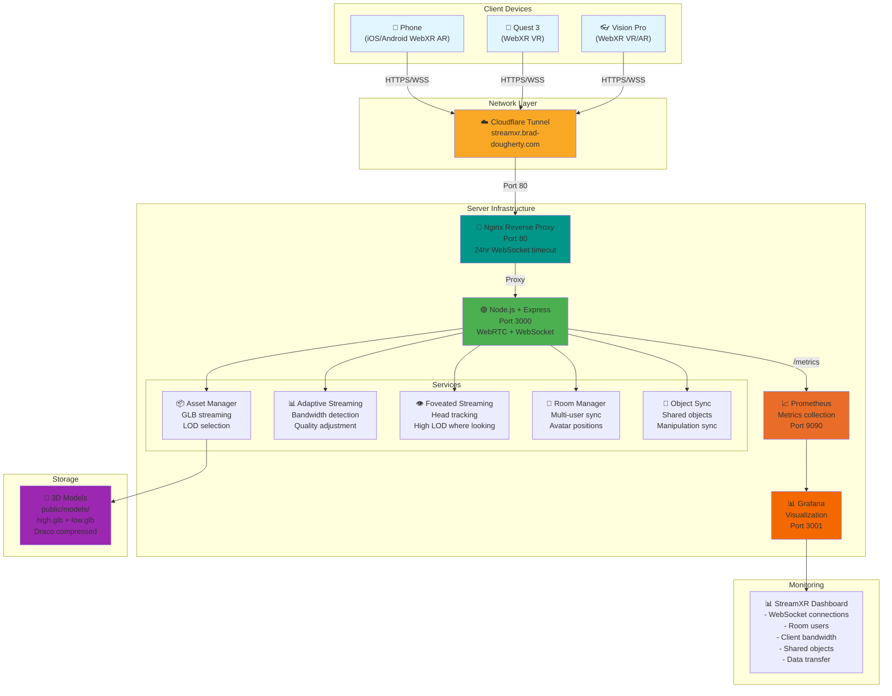
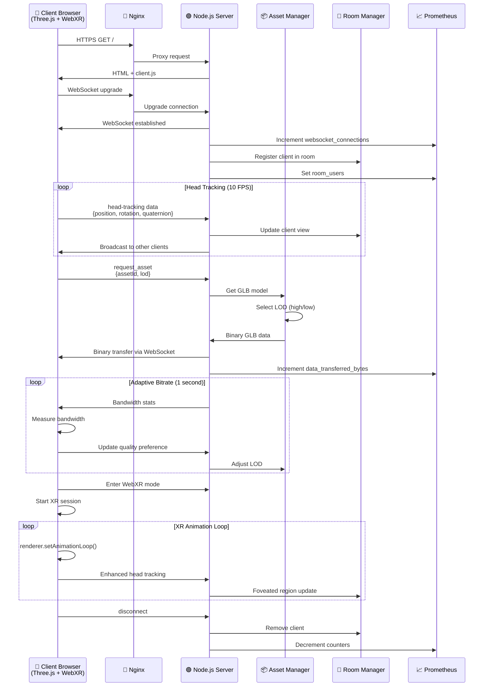
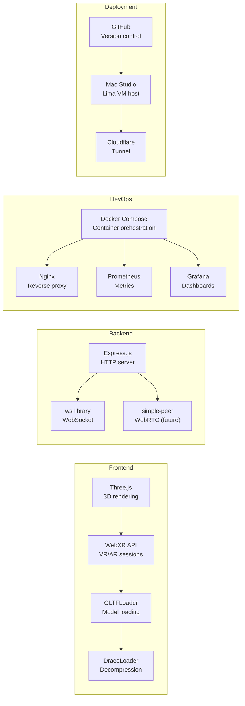
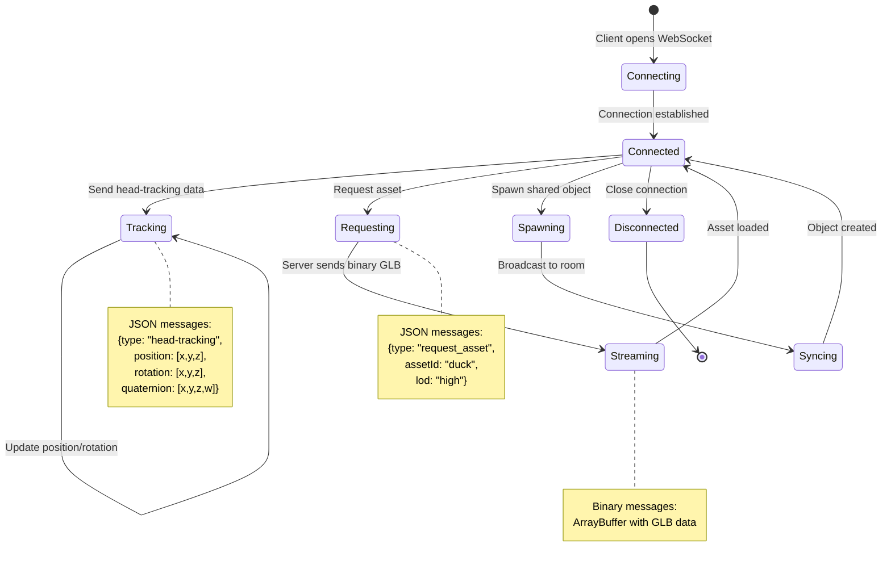
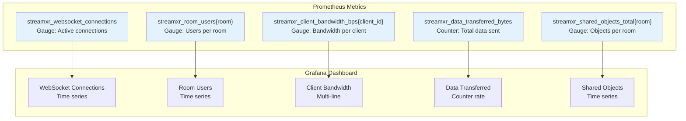

# StreamXR Architecture

## System Overview

## Data Flow

## Technology Stack

## WebSocket Protocol

## Monitoring Metrics

## Deployment Architecture

```mermaid
graph TB
    subgraph "Development"
        Local["💻 Local Development<br/>MacBook<br/>/Users/brad/streamxr"]
        Git["🔀 GitHub<br/>potable-anarchy/streamxr"]
    end

    subgraph "Production Server (Mac Studio + Lima VM)"
        MacStudio["🖥️ Mac Studio<br/>100.81.45.56<br/>Tailscale + Cloudflared"]
        
        subgraph "Lima VM (lima-streamxr)"
            LimaVM["📦 Ubuntu 24.04 VM<br/>100.126.174.124<br/>4 CPUs, 8GB RAM"]
            
            subgraph "Docker Containers"
                C1["nginx:alpine<br/>streamxr-nginx<br/>Port 3000:80"]
                C2["streamxr:latest<br/>streamxr<br/>Expose 3000"]
                C3["prom/prometheus<br/>prometheus<br/>Port 9092:9090"]
                C4["grafana/grafana<br/>grafana<br/>Port 3003:3000"]
            end
        end
    end

    subgraph "Public Access"
        CF2["☁️ Cloudflare Tunnel<br/>streamxr.brad-dougherty.com<br/>streamxr-grafana.brad-dougherty.com<br/>streamxr-prometheus.brad-dougherty.com"]
    end

    Local -->|git push| Git
    Git -->|tar + scp| MacStudio
    MacStudio -->|limactl copy| LimaVM
    LimaVM -->|docker compose up| C1
    LimaVM -->|docker compose up| C2
    LimaVM -->|docker compose up| C3
    LimaVM -->|docker compose up| C4
    
    C1 -->|proxy| C2
    C2 -->|/metrics| C3
    C3 -->|datasource| C4
    
    CF2 -->|http://100.126.174.124:3000| C1
    CF2 -->|http://100.126.174.124:3003| C4
    CF2 -->|http://100.126.174.124:9092| C3
    MacStudio -->|Cloudflare Tunnel| CF2

    style Local fill:#e1f5ff
    style Git fill:#333
    style MacStudio fill:#4caf50
    style LimaVM fill:#2196f3
    style CF2 fill:#f9a825
```

## Current Implementation Status

| Phase | Feature | Status | Files |
|-------|---------|--------|-------|
| 1 | WebRTC Foundation | ✅ Complete | server.js, client.js |
| 2 | Asset Streaming | ✅ Complete | lib/assetManager.js |
| 3 | Adaptive Bitrate | ✅ Complete | lib/adaptiveStreaming.js |
| 4 | Foveated Streaming | ✅ Complete | lib/foveatedStreaming.js |
| 5 | Multiuser | ✅ Complete | lib/roomManager.js |
| 6 | Interactive Objects | ✅ Complete | lib/objectSync.js |
| 7 | Dynamic LOD | 📋 Planned | lib/lodGenerator.js |

## Additional Features

- ✅ **WebXR Support**: Vision Pro, Quest 3, Phone AR/VR
- ✅ **Prometheus Metrics**: Real-time monitoring
- ✅ **Grafana Dashboard**: Visual analytics at streamxr-grafana.brad-dougherty.com
- ✅ **Nginx Reverse Proxy**: 24-hour WebSocket stability
- ✅ **Draco Compression**: Optimized 3D model transfer
- ✅ **Multi-user Simulation**: test-multiuser.js for testing
- ✅ **Lima VM Deployment**: Ubuntu 24.04 on Mac Studio with Tailscale
- ✅ **Shared Object Manipulation**: Grab and move 3D objects in real-time
- 📋 **Hand Tracking**: Vision Pro gestures (planned)

---

*Architecture diagram updated on 2025-12-07*
